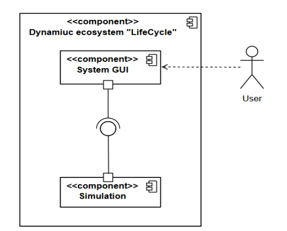
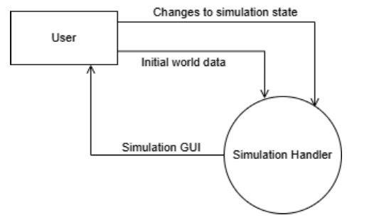
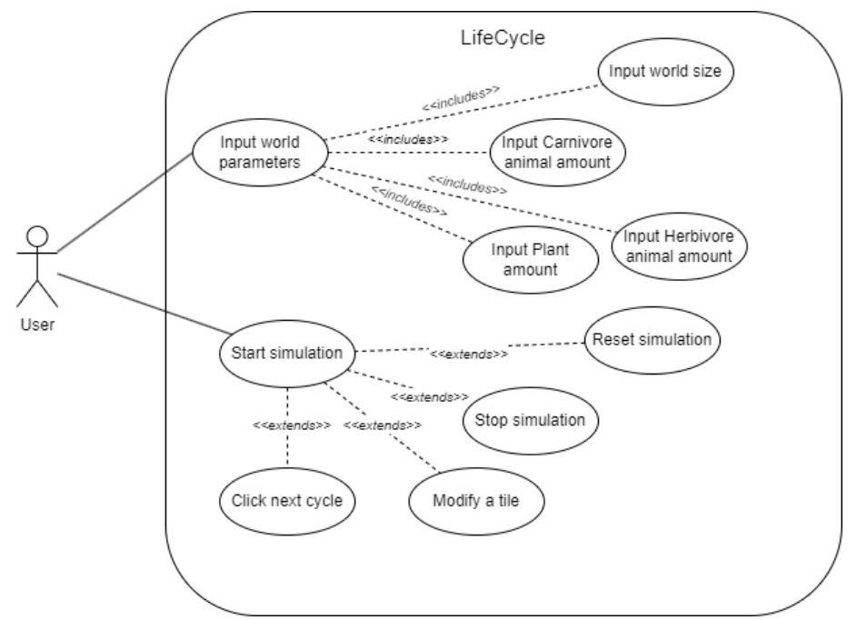
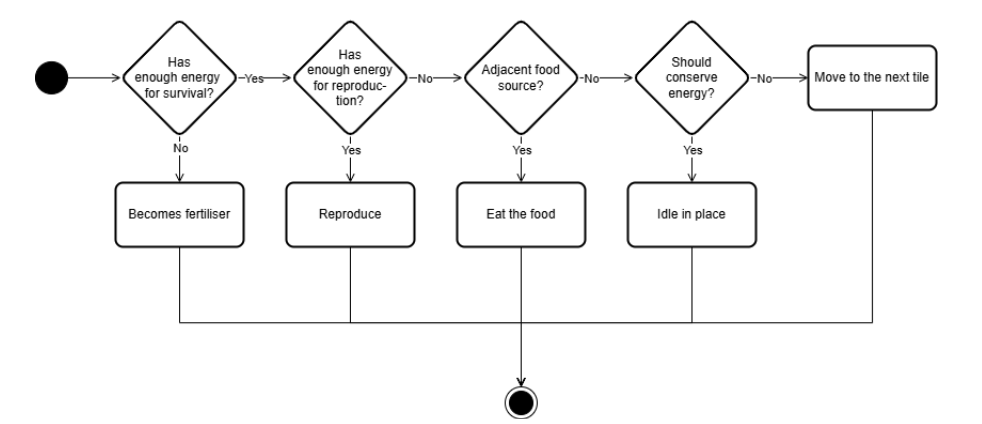

# LifeCycle

## Projekto vizija

### Projekto aprašymas

dinaminės ekosistemos simuliatorius, kuriame augalai, žolėdžiai ir plėšrūnai minta, juda, dauginasi ir miršta pagal paprastus biologinius dėsnius.

### Sistemos aukšto lygio struktūra

#### Sistemos komponentai 

Dinaminė ekosistemos simuliacijos sistema susideda iš komponentų:
- Naudotojas sąveikauja su grafiniu interfeisu.
- Grafinis naudotojo interfeisas atvaizduoja tinklelį, kuriame matomas simuliacijos veikimas, ir leidžia sąveikauti su simuliacija.
- Simuliacija modeliuoja organizmų sąveiką tarpusavyje.

#### Duomenų tėkmė, įvestis ir išvestis
Žemiau esančiame paveikslėlyje pavaistuota „LifeCycle“ sistemos duomenų tėkmė. Vartotojas pasirenka pradinius parametrus (organizmų skaičių, pasaulio dydį), tuomet sistema sukuria pradinę ekosistemos būseną. Kiekvieno ciklo metu „Simulation Handler“ apskaičiuoja organizmų daromus veiksmus ir atitinkamais pakeitimais atnaujina vartotojo sąsają.

### Verslo logika

#### Vartotojo panaudos atvejai
Vartotojas gali nustatyti simuliacijos parametrus kaip pasaulio dydis, augalų bei gyvūnų kiekį ir po to pradėti simuliaciją. Simuliacijos metu vartotojas gali sustabdyti  ir paleisti iš naujo simuliaciją, pereiti prie kito ciklo, pakeisti langelį (pakeisti organizmo stadiją).

#### Veiklos
Vartotojui pradėjus ekosistemos simuliaciją su pradiniais duomenimis, ji vyksta kol bus sustabdyta vartotojo. Po kiekvieno ciklo, sistema atnaujina vartotojo grafinę sąsają pagal visų organizmų atliktus veiksmus.

Kiekvieno ciklo metu kiekvienas simuliacijoje esantis organizmas atlieka vieną iš leistinų veiksmų:
- mišta;
- dauginasi;
- maitinasi;
- juda į kitą vietą;
- stovi vietoje.

### Technologijos ir infrastruktūra
- C++
- CMake - projekto konfigūravimui ir kompiliavimui.
- Catch2 - testų rašymui.
- SFML - grafinės sąsajos kūrimui.

## Įgyvendintas Funkcionalumas

### Pagrindiniai komponentai

**Organizmų tipai:**
- **Augalai (Plants)** - auga naudodami maistingąsias medžiagas, dauginasi kai pasiekia tam tikrą maistingumo slenkstį
- **Gyvūnai (Animals)** - gali būti žolėdžiai, mėsėdžiai ar visaėdžiai, juda po aplinką ieškodami maisto, dauginasi kai turi pakankamai maisto medžiagų.

**Aplinkos valdymas:**
- **Position sistema** - tikslus objektų pozicijos valdymas erdvėje
- **Grid sistema** - dvimatė erdvė padalinta į langelius (angl. *tiles*)
- **WorldManager** - valdo visus organizmus ir aplinkos procesus

### Simuliacijos mechanizmai

1. **Augalų elgesys:**
   - Sugeria maistingąsias medžiagas iš aplinkos
   - Dauginasi į gretimus tuščius langelius
   - Miršta pasiekus maksimalų amžių

2. **Gyvūnų elgesys:**
   - Juda po aplinką ieškodami maisto
   - Medžioja pagal savo tipą (žolėdžiai valgo augalus, mėsėdžiai - kitus gyvūnus)
   - Dauginasi turėdami pakankamai maistingumo
   - Vartoja energiją judėdami ir atlikdami kitus veiksmus

3. **Ekosistemos ciklai:**
   - Mirusių organizmų vietoje atsiranda nauji augalai

## Naudojimasis

1. **Paleidus programą** atsidaro vartotojo sąsaja, kur vartotojas gali pasirinkti pradinius simuliacijos nustatymus.
2. 🟢**Žali kvadratėliai** - augalai
3. 🔵**Mėlyni kvadratėliai** - žolėdžiai gyvūnai
4. 🔴**Raudoni kvadratėliai** - mėsėdžiai gyvūnai
5. ⬜**Pilki kvadratėliai** - tušti langeliai

Simuliacija pagal nutylėjimą vyksta 2 FPS greičiu, kad būtų galima stebėti kiekvieno ciklo veiksmus.

## Projektavimo šablonai

### 1. Pimpl (Pointer to Implementation) Idiom
**Vieta:** `Grid.h/GridImpl.h`, `Position.h/PositionImpl.h`, `Tile.h/TileImpl.h`

**Paskirtis:** Atskiria interfeisą nuo implementacijos, sumažina kompiliavimo priklausomybes ir leidžia keisti implementaciją nekeičiant kliento kodo.

### 2. Singleton Pattern
**Vieta:** `WorldManager.h/WorldManager.cpp`

**Paskirtis:** Užtikrina, kad egzistuoja tik vienas WorldManager egzempliorius, kuris valdo visą simuliacijos būseną.

## Testavimo scenarijai
### Scenarijus 1: Gyvūnų funkcionalumas
**Pradinis būsena:** Kuriami įvairūs gyvūnai su skirtingais parametrais
**Tikėtinas rezultatas:**
- Gyvūnai teisingai sukuriami su nurodytais parametrais (maistingosios medžiagos, tipas, greitis, regėjimo atstumas)
- Gyvūnai gali dauginimosi būklėje patikrinti ar pasirengę dauginimosi procesui
- Gyvūnai sėkmingai dauginasi kai turi pakankamai maistingųjų medžiagų
- Gyvūnai vartoja išteklius pagal savo poreikius

### Scenarijus 2: Gyvūnų mityba ir dietos apribojimai
**Pradinis būsena:** Kuriami žolėdžiai, plėšrūnai ir visaėdžiai gyvūnai bei jų galima pėdal
**Tikėtinas rezultatas:**
- Žolėdžiai gali valgyti tik augalus
- Plėšrūnai gali valgyti tik kitus gyvūnus
- Visaėdžiai gali valgyti ir augalus, ir gyvūnus
- Valgymas prideda teisingą kiekį maistingųjų medžiagų

### Scenarijus 3: Gyvūnų dauginimasis su maistingųjų medžiagų suvartojimu
**Pradinis būsena:** Gyvūnai su skirtingais maistingųjų medžiagų kiekiais
**Tikėtinas rezultatas:**
- Dauginimasis suvartoja teisingą kiekį maistingųjų medžiagų
- Palikuonys gauna teisingas pradines maistingąsias medžiagas
- Palikuonys paveldi tėvų savybes su variacijom

### Scenarijus 4: Gyvūnų senėjimas ir mirtis
**Pradinis būsena:** Gyvūnai su skirtingu amžiumi ir maistingųjų medžiagų kiekiu
**Tikėtinas rezultatas:**
- Gyvūnai miršta nuo senatvės pasiekę maksimalų amžių
- Gyvūnai miršta nuo bado išsekus maistingoms medžiagoms
- Gyvūnai išgyvena turėdami pakankamai maistingųjų medžiagų ir būdami jauni

### Scenarijus 5: Organizmų bazinis funkcionalumas
**Pradinis būsena:** Kuriami baziniai organizmai (augalai)
**Tikėtinas rezultatas:**
- Organizmai teisingai sukuriami su pradiniais parametrais
- Maistingųjų medžiagų valdymas veikia teisingai (pridėjimas/suvartojimas)
- Amžiaus valdymas veikia teisingai
- Mirties sąlygos (amžius/badavimas) veikia teisingai

### Scenarijus 6: Organizmų pozicijos valdymas
**Pradinis būsena:** Organizmai be pozicijos arba su pradinėmis pozicijomis
**Tikėtinas rezultatas:**
- Pozicijos teisingai nustatomos ir gaunamos
- Pozicijos gali būti atnaujinamos
- Organizmai atpažįstami pagal tipą (augalas/gyvūnas)

### Scenarijus 7: Augalų augimas ir dauginimasis
**Pradinis būsena:** Augalai su skirtingais maistingųjų medžiagų kiekiais
**Tikėtinas rezultatas:**
- Augalai absorbuoja maistingąsias medžiagas pagal savo rodiklius
- Augalai pasirengę dauginimosi procesui turėdami >8 maistingųjų medžiagų
- Sėkmingas dauginimasis sukuria palikuonis ir suvartoja tėvų maistingąsias medžiagas
- Augalai nevartoja išteklių kaip gyvūnai

### Scenarijus 8: Pozicijos matematika
**Pradinis būsena:** Pozicijos objektai su skirtingomis koordinatėmis
**Tikėtinas rezultatas:**
- Atstumo skaičiavimas veikia teisingai (horizontalus, vertikalus, įstrižas)
- Gretimų pozicijų radimas veikia teisingai
- Neigiamų koordinačių filtravimas kampuose ir kraštuose

### Scenarijus 9: Langelių ir tinklelio funkcionalumas
**Pradinis būsena:** Tušti langeliai ir tinkleliai su skirtingais dydžiais
**Tikėtinas rezultatas:**
- Langeliai teisingai saugo ir valdo organizmus
- Tinklelio ribos tikrinamos teisingai
- Artimiausių tuščių langelių ir organizmų paieška veikia
- Klaidų apdorojimas už ribų esantiems elementams

### Scenarijus 10: Pasaulio valdytojo singleton šablonas
**Pradinis būsena:** Pasaulio valdytojo egzempliorių kūrimas
**Tikėtinas rezultatas:**
- Singleton šablonas užtikrina vieną egzempliorių
- Tinklelis sukuriamas su pradiniais parametrais
- Tinklelis nepersikuria su naujais parametrais

### Scenarijus 11: Organizmų valdymas pasaulio valdytoje
**Pradinis būsena:** Tuščias pasaulis ir organizmai pridėjimui
**Tikėtinas rezultatas:**
- Organizmai sėkmingai pridedami į tinklelį
- Apsauga nuo dubliavimo užimtuose langeliuose
- Apsauga nuo pridėjimo už tinklelio ribų
- Null objektų apdorojimas

### Scenarijus 12: Organizmų šalinimas
**Pradinis būsena:** Pasaulis su organizmais
**Tikėtinas rezultatas:**
- Organizmai šalinami pagal nuorodą arba poziciją
- Langeliai išvalomi po šalinimo
- Null ir tuščių pozicijų apdorojimas

### Scenarijus 13: Augalų atsiradimas iš mirusiųjų organizmų
**Pradinis būsena:** Pozicijos kur turi atsirasti augalai iš mirusiųjų organizmų
**Tikėtinas rezultatas:**
- Augalai sukuriami su teisingais maistingųjų medžiagų kiekiais
- Minimalių maistingųjų medžiagų užtikrinimas
- Apsauga nuo kūrimo užimtuose langeliuose

### Scenarijus 14: Pasaulio atnaujinimo funkcionalumas
**Pradinis būsena:** Pasaulis su organizmais arba be jų
**Tikėtinas rezultatas:**
- Atnaujinimas nesugriauna tuščio pasaulio
- Organizmų gyvavimo ciklų valdymas
- Organizmų mirties ir skilimo apdorojimas

### Scenarijus 15: Integruotos ekosistemos simuliacija
**Pradinis būsena:** Mišri ekosistema su augalais ir gyvūnais
**Tikėtinas rezultatas:**
- Bazinė ekosistema lieka stabili per kelis atnaujinimo ciklus
- Daugiorganizminė ekosistema veikia ribotose srityse
- Sistema išlaiko protingus organizmų skaičius